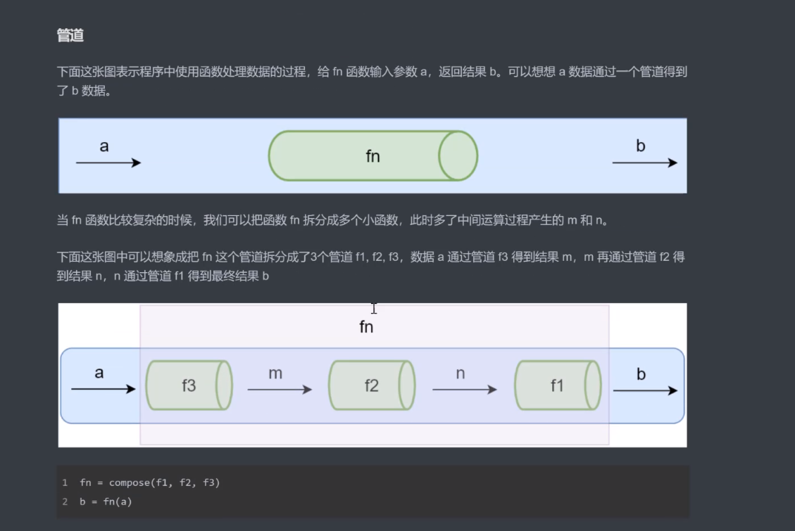

# 1. 函数式编程

为什么要学习函数式编程

> 函数式编程是非常古老的一个概念，早于第一台计算机的诞生，[函数式编程的历史](https://baike.baidu.com/item/%E5%87%BD%E6%95%B0%E5%BC%8F%E7%BC%96%E7%A8%8B/4035031#1)。

- 函数式编程是随着 react 的流行受到越来越多的关注 (react 的高阶组件是函数式编程的概念: 高阶函数) (并不是纯函数式的)
- Vue3 也开始用函数式编程
- 函数式编程可以抛弃 this
- 打包过程中可以更好的利用 tree shaking 过滤无用代码
- 方便测试、方便并行处理等 (函数式编程的特性: 纯函数)
- 有很多库可以帮助我们进行函数式开发：lodash、underscore、ramda

什么是函数式编程

> 函数式编程就是利用纯函数来实现一些细粒度的函数，然后通过函数的组合把这些细粒过的函数组合成功能更强大的函数
> 最后通过以下方式来了解函数式编程的特性和功能以及应用场景

函数式编程(FP), FP 是编程范式之一，我们常听说的编程范式还有面向过程编程、面向对象编程。

- 面向过程编程的思维方式：按照步骤来一步一步来实现我们想要的功能
- 面向对象编程的思维方式：把现实世界中的事务抽象成程序世界中的类和对象，通过封装、继承和多态来演示事物之间的联系。
- 函数式编程的思维方式： 把现实世界中的事物和事物之间的联系抽象到程序世界 (对运算过程进行抽象)
  - 程序的本质：根据输入通过某种运算获得相应的输出，程序开发过程中会设计很多有输入和输出的函数
  - x -> f(联系、映射) -> y, y=f(x) (数学中的函数)
  - 函数式编程中的函数指的不是程序中的函数(方法)，而是数学中的函数即映射关系，例如： y = sin(x), x 和 y 的关系
  - 相同的输入始终得到相同的输出(纯函数)
  - 总结： 函数式编程是用来描述数据(函数)之间的映射， 或者说函数式编程就是对运算过程的抽象

函数式编程的概念

- 函数是一等公民 (First-class Function)
  - 函数可以存储在变量中
  - 函数作为参数
  - 函数作为返回值
  - 函数是一等公民是我们后面要学习的高阶函数、柯里化等的基础。
    > 在 js 中函数是个普通的对象，所以可以把函数存储到变量中，还可以作为一个函数的参数和返回值
- 高阶函数 (Higher-order function)
  - 函数作为参数传递给另一个函数
    > 优点： 可以让我们这个函数更灵活，不需要考虑他内部是怎么实现的,把内部实现的细节屏蔽了,函数的名称是有实际意义的。
  - 函数作为另一个函数的返回值
  - 高阶函数的意义：
    - 抽象可以帮我们屏蔽细节，只需要关注与我们的目标
    - 高阶函数是用来抽象通用的问题 (通用问题的抽象)
  - 常用的高阶函数 [forEach,map,filter,every,some,find,findIndex,reduce,sort](https://juejin.im/post/5d82c12ff265da03a31d6f92)
- 闭包 (Closure):
  - 闭包：函数和其周围的状态（词法环境） 的引用捆绑在一起形成闭包
    > 在另一个作用域中调用一个函数的内部函数并访问到该函数的作用域中的成员
  - 闭包的本质：函数在执行的时候会放到一个执行栈上当函数执行完毕之后会从执行栈上移除，但是堆上的作用域成员因为被外部引用不能被释放，因此内部函数依然可以访问外部函数的成员

## 1.1 函数式编程的特性

### 1.1.1 纯函数

纯函数的概念

- <font color="red" size=3>纯函数：相同的输入永远得到相同的输出,</font> 而且没有任何观察的副作用
  - 纯函数就类似数学中的函数(用来描述输入和输出之间的关系) y = f(x)
  - lodash 是一个纯函数的功能库，提供了对数组、数字、对象、字符串、函数等操作的一些方法
    - slice 返回数组的指定部分，不会改变原数组 (纯函数)
    - splice 对数组进行操作返回该数组，会改变原数组 (不是纯函数)
  - 函数式编程不会保留计算中间的结果，所以变量是不可变的（无状态的）
  - 我们可以把一个函数的执行结果交给另一个函数去处理

纯函数的好处

- 可缓存
  - 因为纯函数对相同的输入始终有相同的结果，所以可以把纯函数的结果缓存起来
- 可测试 (始终有输入和输出)
  - 纯函数让测试更方便
- 并行处理
  - 在多线程环境下并行操作共享的内存数据很可能会出现意外情况 (不是纯函数会造成的)
  - 纯函数不需要访问共享的内存数据，所以在并行环境下可以任意运行纯函数 （Web Worker 多线程 (纯函数就不会造成上面的情况 )

副作用

- 纯函数：相同的输入永远得到相同的输出，而且没有任何观察的副作用
- 副作用让一个函数变的不纯，纯函数根据相同的输入返回相同的输出，如果函数依赖于外部的状态就无法保证输出相同，就会带来副作用 (概念)
- 副作用来源
  - 全局变量
  - 配置文件
  - 数据库
  - 获取用户的输入
  - ....
- 所有的外部交互都有可能带来副作用，副作用也使得方法通用性下降不适合扩展和可重用性，同时副作用会给程序中带来安全隐患和不确定性，但是副作用不可能完全禁止，尽可能控制它们在可控范围内发生。 (缺点) (用户输入带来的跨站攻击)

### 1.1.2 柯里化 (Haskell Brooks Curry) 闭包+高阶函数 (纯函数)

- 使用柯里化解决硬编码的问题
- 柯里化 (Currying) (多元函数->一元函数的转变 把之前的结果存起来)
  - 当一个函数有多个参数的时候先传递一部分参数调用它 (这部分参数以后永远不变)
  - 然后返回一个新的函数接受剩余的参数，并返回结果
- lodash 中的柯里化函数 \_curry(func)
  - 功能： 创建一个函数，该函数接收一个或多个 func 的参数，如果 func 所需要的参数都被提供则执行 func 并返回执行的结果，否则继续返回该函数并等待接受剩余的参数。
  - 参数： 需要柯里化的函数

总结

- 柯里化可以让我们给一个函数传递较少的参数得到一个已经记住了莫些固定参数的新函数 (使用 match 柯里化函数记住了正则的功能)
- 这是一种对函数参数的 <font color="red"> “缓存” </font> (使用了闭包)
- 让函数变得更灵活，让函数的粒度更小 (函数拆分成更小的函数)
- 可以把多元函数转换成一元函数 (多个参数的函数变成一个参数的函数)，可以组合使用函数产生强大的功能 (后续使用组合函数把一元函数组和成功能更强大的函数)

### 1.1.3 函数组合

为什么需要函数组合

- 纯函数和柯里化很容易写出洋葱代码 h(g(f(x)))
  - 获取数组的最后一个元素再转换成大写字母， _toUpper(_.first(\_.reverse(array)))

了解函数组合

- 函数组合可以让我们把细粒度的函数重新组合生成一个新的函数
- 下面通过管道了解函数组合的本质



函数组合概念

- 函数组合(compose)： 如果一个函数要经过多个函数处理才能得到最终值，这个时候可以把中间过程的函数合并成一个函数
  - 函数就像是数据的管道，函数组合就是把这些管道连接起来，让数据穿过多个管道形成最终结果
  - <font color="red" size=4>函数组合默认是从右到左执行</font>
- 函数组合让我们把多个函数组合成一个新的函数，执行过程中把参数输入给第一个函数，第一个函数执行完返回一个中间结果交给下一个函数处理，当最后一个函数执行完成之后，把最终结果返回。

lodash 中的函数组合

- lodash 中组合函数 flow() 或者 flowRight(), 他们都可以组合多个函数
- flow() 是从左到右执行
- flowRight() 是从右到左执行，使用的更多一些

函数的组合要满足结合律 (associativity)

- 有 f,g,h 三个函数， 我们即可以把 g 和 h 组合，还可以把 f 和 g 组合, 结果都是一样

## 1.2 函数式编程库

### 1.2.1 [Lodash 库](https://www.lodashjs.com/)

1. lodash 模块

- 不可变，数据优先，函数之后

2. lodash/fp

- lodash 的 fp 模块提供了实用的对<font color="red" size=4>函数式编程友好</font>的方法
- 提供了 auto-curried(可变) iteratee-first(函数优先) data-last(数据之后) 的方法
- fp 模块中的函数 都是 被柯里化的函数 (例如:map,split)

```js
// lodash 模块
const _ = require("lodash");
_.map(["a"], _.toUpper); // 数据优先，函数之后

const fp = require("lodash/fp");
fp.map(_.toUpper, ["a"]); // 函数优先，数据之后
fp.map(_toUpper)(["a"]); // fp 的 map方法是柯里化的函数
```

## 1.3 其他方式

### 1.3.1 Point Free

- Point Free 是一种编程风格，具体的实现是函数的组合
- Point Free: 我们可以把数据处理的过程定义成与数据无关的合成运算，不需要用到代表数据的那个参数，只要把简单的运算步骤合成到一起，在使用这种模式之前我们需要定义一些辅助的基本运算函数。
  - 不需要指明处理的数据
  - <font color="red">只需要合成运算过程</font>
  - 需要定义一些辅助的基本运算函数

```js
// 非 Point Free 模式
// Hello World => hello_word
function f(word) {
  return word.toLowerCase().replace(/\s+/g, "_");
}
// Point Free 模式
const fp = require("lodash/fp");

// 需要定义一些辅助的基本运算函数 fp.replace,fp.replace fp.toLower
const f = fp.flowRight(fp.replace(/\s+/g, "_"), fp.toLower);
// 不需要用到代表数据的那个参数,只要把简单的运算步骤合成到一起
console.log(f("Hello World"));
```

## 1.4 函子 (Functor)

### 1.4.1 Functor 函子

<font size=3>为什么要学习函子</font>

到目前为止已经学习了函数式编程的一些基础，但是我们还没有演示在函数式编程中如何把副作用控制在可控的范围内、异常处理、异步操作等。

<font size=3>什么是函子</font>

- 容器: 包含值和值的变形关系(这个变形关系就是函数) 简单点说就是包含了值和处理这个值的函数
- 函子: 是一个特殊的容器，通过一个普通的对象来实现，该对象具有 map 方法，map 方法接收一个参数，这个参数是对值处理的函数(变形关系)

<font size=3>函子的实现方式</font>

> 1. 维护一个值，不对外公布
> 2. 对外提供一个 map，map 方法接受一个处理值的函数
>    调用 map 方法的时候，会调用这个处理值的函数去处理值
>    并且把处理后的结果传递给新的函子,由新的函子保存

<font size=3>总结</font>

- 函数式编程的运算不直接操作值，而是由函子操作
- 函子就是一个实现了 map 契约的对象
- 我们可以把函子想象成一个盒子，这个盒子里封装了一个值
- 想要处理盒子中的值，我们需要给盒子的 map 方法传递一个处理值的函数（纯函数），由这个函数来对值进行处理
- 最终 map 方法返回一个包含新值的盒子（函子）

### 1.4.2 MayBe 函子

- 我们在编程的过程中可能会遇到很多错误，需要对这些错误做相应的处理
- MayBe 函子的作用就是可以对外部的空值情况做处理（控制副作用在允许的范围）

### 1.4.3 Either 函子

- Either 两者中的任何一个，类似于 if..else 的处理
- 异常会让函数变的不纯，Either 函子可以用来做异常处理

## 1.5 函数式编程的应用场景
