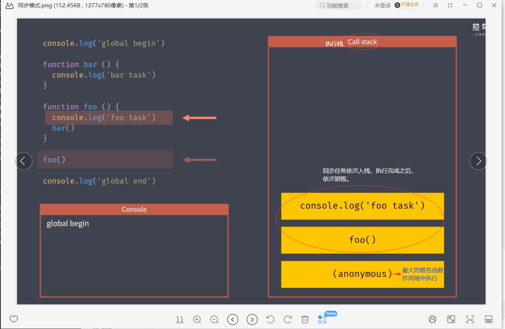
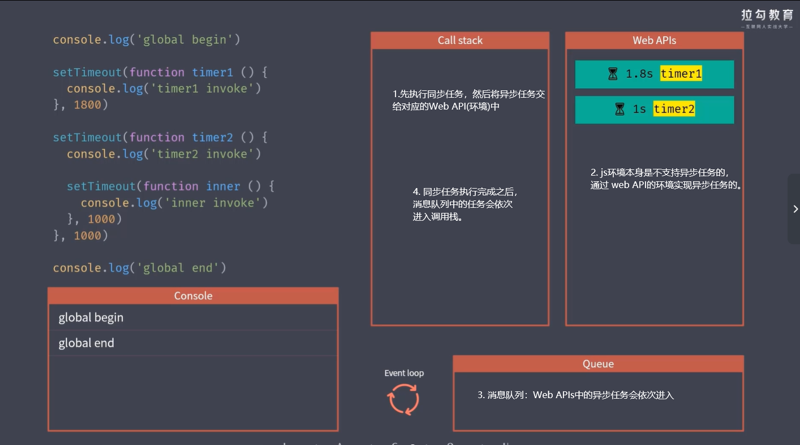
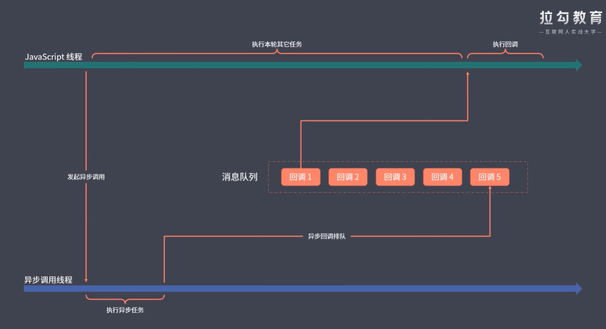
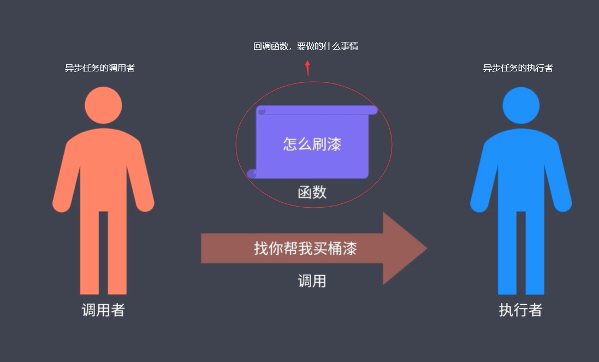
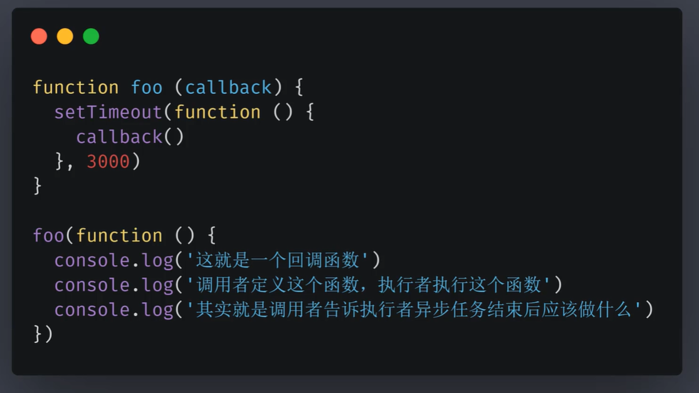

# 1. 异步编程

为什么会出现单线程 js 异步方案

- 采用单线程模式工作的原因
  - 多个线程操作 dom，无法明确已哪个线程的结果为主。
- 单线程是 js 运行环境中负责执行代码的线程只有一个 (一个人一次只能做一件事)

  - 优点： 更安全，更简单
  - 缺点： 如果出现一个耗时的任务，会阻塞后面的任务，导致假死的情况

- 为了解决耗时任务阻塞导致假死的情况, js 将任务的执行模式分成了两种
  - 同步模式 (Synchronous)
  - 异步模式 (Asynchronous)

## 1.1 同步模式与异步模式

同步模式

- js 代码中的任务依次执行，后一个任务要等待前一个任务结束才执行。(排队执行)

  

- 缺点 莫个任务或者莫行代码执行的事件过长，后面的任务就会延迟，我们把这种延迟就叫阻塞，对用户来说就是卡顿，卡死。

异步模式

- 不会去等待这个任务的结束才开始下一个任务
- 开启过后就立即往后执行下一个任务
- 后续逻辑一般会通过回调函数的方式来定义
- 优点：解决单线程 js 语言无法同时处理大量耗时的任务
- 难点(缺点)：代码的执行顺序混乱
- 运行环境提供的 API 是以同步或异步模式的方式工作 (js 是单线程的，浏览器不是的)

  

  

回调函数 -

## 1.2 事件循环与消息队列

异步模式就是通过事件循环与消息队列实现的

## 1.3 回调函数

js 实现异步编程的根本方式就是回调函数

回调函数的概念

- 所有异步编程方案的根基
- 回调函数可以理解为一件你想要做的事情
- 由调用者定义，交给执行者执行的函数就是回调函数

## 1.3 异步编程的几种方式

- 传递函数参数回调 (setTimeout)
  
- 事件机制
- 发布订阅
- 以上都是基于回调函数的变体罢了

## 1.4 Promise

## 1.4 Promise 异步方案、宏任务/微任务队列

## 1.5 Generator 异步方案、Async/Await 语法糖
